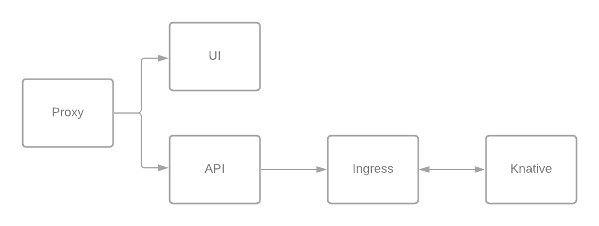

# Overview

Direktiv is a solution with multiple components. All components shown in the following diagram can be secured with TLS to provide encryption on all these levels.

<p align="center">
  
</p>

**Proxy:**

The default LoadBalancer for direktiv is [Contour](https://github.com/projectcontour/contour). To use TLS here the ingress object needs a certificate and a hostname
during helm installation. The certificate has to be in the same namespace direktiv is running in.

*Example:*
```yaml
ingress:
  certificate: direktiv-lb
  host: myhost.mydomain
```

**Proxy -> API/UI**

To encrypt traffic between the proxy and UI/API services the following helm variable needs to be set:

```yaml
uiapiCertificate: direktiv-uiapi
```

**API -> Ingress / Knative -> Ingress**:

Both communication channels using GRPC. The first channel is used to execute API requests within direktiv.
The second channel reports the result of an isolate exectuion back to the flow component of direktiv.

To apply this certificate to the flow component (default port 7777) and the ingress component (default port 6666) the
value *'flow.certificate'* needs to be set during helm installation. The value is the name of the secret.
It makes the certificate available to the container at */etc/certs/direktiv*.

*Example:*
```yaml
flow:
  certificate: direktiv-grpc
```

**Ingress -> Knative**:

Workflows can execute containers during execution. Direktiv is using knative to execute those services. To initiate a container the flow component is
executing a HTTP POST request. This call is internally routed via Contour. To use TLS on that layer a certificate has to be assigned to the internal
Contour.

```yaml
apiVersion: projectcontour.io/v1
kind: TLSCertificateDelegation
metadata:
  name: default-delegation
  namespace: contour-internal
spec:
  delegations:
    - secretName: direktiv-certificate
      targetNamespaces:
      - "*"
```

Update the Knative Contour plugin to start using the certificate as a fallback when auto-TLS is disabled:

```sh
kubectl patch cm config-contour -n knative-serving \
  -p '{"data":{"default-tls-secret":"contour-internal/direktiv-knative"}}'
```

# **Simple example using cert-manager:**

This example enables TLS for all components and mTLS for the direktiv GRPC requests. Depending on the security requirements of the installation individual parts can be omitted.
Cert-Manager is used to create self-signed certificates as an example and uses the default namespace.

## Install cert-manager

If [cert-manager](https://cert-manager.io/docs/installation/kubernetes/) is not installed in the cluster it can easily done:

```sh
kubectl apply -f https://github.com/jetstack/cert-manager/releases/download/v1.3.1/cert-manager.yaml
```

## Create an issuer

An issuer is required to create certificates. The following yaml command creates an issuer and CA:

```yaml
apiVersion: cert-manager.io/v1
kind: ClusterIssuer
metadata:
  name: selfsigned-issuer
spec:
  selfSigned: {}
---
apiVersion: cert-manager.io/v1
kind: Certificate
metadata:
  name: direktiv-ca
  namespace: default
spec:
  isCA: true
  commonName: direktiv-system
  secretName: direktiv-ca
  issuerRef:
    name: selfsigned-issuer
    kind: ClusterIssuer
    group: cert-manager.io
---
apiVersion: cert-manager.io/v1
kind: Issuer
metadata:
  name: direktiv-ca
  namespace: default
spec:
  ca:
    secretName: direktiv-ca
```

After applying this YAML file, the instalation can be checked with *kubectl get ClusterIssuers*. The ready status should say 'True'.

```sh
kubectl get ClusterIssuers

NAME                READY   AGE
selfsigned-issuer   True    12s
```

## Securing GRPC services (TLS)

The first step is to create a certificate for the grps services.

```yaml
apiVersion: cert-manager.io/v1
kind: Certificate
metadata:
  name: direktiv-grpc
  namespace: default
spec:
  secretName: direktiv-grpc
  dnsNames:
  - "*.default.svc.cluster.local"
  - "*.default"
  issuerRef:
    name: selfsigned-issuer
    kind: ClusterIssuer
```

This command creates the certificate to use. After applying this yaml successfully it can be referenced in *'flow.certificate'* for helm deployments.

## Securing knative services

First a certificate needs to be created with cert-manager for the contour-internal namespace.

```yaml
apiVersion: cert-manager.io/v1
kind: Certificate
metadata:
  name: direktiv-knative
  namespace: contour-internal
spec:
  secretName: direktiv-knative
  dnsNames:
  - "*.default.svc.cluster.local"
  - "*.default"
  issuerRef:
    name: selfsigned-issuer
    kind: ClusterIssuer
```

After applying the file  if it was successful:

```sh
kc -n contour-internal get certificate

NAME               READY   SECRET             AGE
direktiv-knative   True    direktiv-knative   26s
```

After this step follow the instructions on the [knative website](https://knative.dev/docs/serving/using-a-tls-cert/):

* Apply certificate

```yaml
apiVersion: projectcontour.io/v1
kind: TLSCertificateDelegation
metadata:
  name: default-delegation
  namespace: contour-internal
spec:
  delegations:
    - secretName: direktiv-knative
      targetNamespaces:
      - "*"
```

* Patch contour

```sh
kubectl patch cm config-contour -n knative-serving \
  -p '{"data":{"default-tls-secret":"contour-internal/direktiv-knative"}}'
```

To enable the flow engine to use HTTPS it needs the helm variable *'flow.protocol'* set to 'https'.

## Securing Proxy / Loadbalancer

Create or provide a certificate for the Loadbalancer. To do so this certificate will be added to the ingress configuration in direktiv's namespace.
This certificate has to be created in the namespace of the ingress, in this case 'default'. It is also important to change the dnsNames.

```yaml
apiVersion: cert-manager.io/v1
kind: Certificate
metadata:
  name: direktiv-lb
  namespace: default
spec:
  secretName: direktiv-lb
  dnsNames:
  - "localhost"
  - "myhost.mydomain" <-- THIS NEEDS TO CHANGE!!!
  issuerRef:
    name: selfsigned-issuer
    kind: ClusterIssuer
```

This certificate needs to be referenced during helm installation like this:

```yaml
ingress:
  certificate: direktiv-lb
  host: myhost.mydomain
```

## Securing API / UI

To secure th API/UI there is another certificate needed.

```yaml
apiVersion: cert-manager.io/v1
kind: Certificate
metadata:
  name: direktiv-uiapi
  namespace: default
spec:
  secretName: direktiv-uiapi
  dnsNames:
  - "*.default.svc.cluster.local"
  - "*.default"
  issuerRef:
    name: selfsigned-issuer
    kind: ClusterIssuer
```

After creating this the helm variable *'uiapiCertificate'* enables TLS for the UI and API.

```yaml
uiapiCertificate: direktiv-uiapi
```

## GRPC mTLS

TODO

## Example helm yaml

TLS related values only.

```yaml
flow:
  protocol: "https"
  certificate: direktiv-grpc

ingress:
 certificate: direktiv-lb
 host: myhost.mydomain

uiapiCertificate: direktiv-uiapi
```
