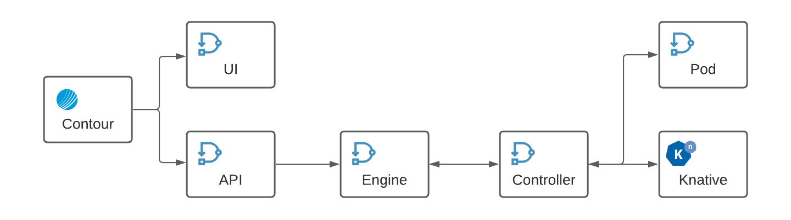

# Overview

Although SSL termination is a normal configuration for an installtion of Direktiv all components can be secured with TLS.
Additionally the GRPC servers can be enabled to use mTLS. The following diagram shows all components and their communication
paths.

<p align="center">
  
</p>

**Proxy:**

The default LoadBalancer for direktiv is [Contour](https://github.com/projectcontour/contour). To use TLS here the ingress object needs a certificate and a hostname during helm installation. The certificate has to reference a valid TLS secret in the kubernetes namespace of direktiv.

*Example:*
```yaml
ingress:
  certificate: direktiv-lb
  host: myhost.mydomain
```

**Proxy - API/UI**

To encrypt traffic between the proxy and UI/API services the following helm variables need to be configured.

```yaml
api:
  certificate: api-cert
ui:
  certificate: ui-cert
```

**API - Engine - Controller**:

The communication channel between API, direktiv and isolates is using GRPC. In consists of three communication channels in total. The first channel is between API and direktiv's engine which runs usually on port 6666. The second channel is for communicating between the engine and an function controller (port 5555), which is responsible for starting pods created during workflow/service runs. The last GRPC channel is for communicating back results from workflow pods to the engine (port 7777).

*Engine Certificates:*
```yaml
flow:
  certificates:
    # securing engine port 7777
    flow: myFlowCertSecret
    mtlsFlow: none
    # securing engine port 6666
    ingress: myIngressCertSecret
    mtlsIngress: none
```

*Controller Certificates:*
```yaml
isolates:
  certificate: direktiv-cert-fn
  mtls: none
```

if mTLS is required the mtls values of the services have to change from none to the same secret used for TLS, e.g.

```yaml
flow:
  certificates:
    # securing engine port 7777
    flow: myFlowCertSecret
    mtlsFlow: myFlowCertSecret
```

If TLS or mTLS is turned on on the flow component it is important to create a secret in the service namespace (default: direktiv-services-direktiv) with the same name.


**Direktiv - Knative**:

Workflows can execute containers during execution. Direktiv is using knative to execute those services. To initiate a container the flow component is executing a HTTP POST request. This call is internally routed via Contour. To use TLS on that layer a certificate has to be assigned to the internal Contour.

```yaml
apiVersion: projectcontour.io/v1
kind: TLSCertificateDelegation
metadata:
  name: default-delegation
  namespace: contour-internal
spec:
  delegations:
    - secretName: direktiv-cert-knative
      targetNamespaces:
      - "*"
```

Update the Knative Contour plugin to start using the certificate as a fallback when auto-TLS is disabled:

```sh
kubectl patch cm config-contour -n knative-serving-knative \
  -p '{"data":{"default-tls-secret":"contour-internal/direktiv-cert-knative"}}'
```

This TLS secret need to be with Contour's internal namespace.

**Direktiv - Pods**:

It is importan to know that both service types, knative and pod-based, need to either use TLS or plain text communication.
It is not possible to run only one backend with TLS. To enable TLS on service pods the secrets needs to be configured:

```yaml
functions:
  initPodCertificate: direktiv-cert-flow
```

This certicate needs the same certifcate authority used under the flow configuration:

```yaml
flow:
  functionsProtocol: "https"
  functionsCA: "direktiv-cert-knative"
```

# **Simple example using cert-manager:**

This example enables TLS for all components and mTLS for the direktiv GRPC requests. Depending on the security requirements of the installation individual parts can be omitted. Cert-Manager is used to create self-signed certificates as an example and uses the default namespace.

## Install cert-manager

If [cert-manager](https://cert-manager.io/docs/installation/kubernetes/) is not installed in the cluster it can easily done:

```sh
kubectl apply -f https://github.com/jetstack/cert-manager/releases/latest/download/cert-manager.yaml
```

## Create an issuer

An issuer is required to create certificates. The following yaml command creates an issuer and CA:

```yaml
apiVersion: cert-manager.io/v1
kind: ClusterIssuer
metadata:
  name: selfsigned-issuer
  namespace: cert-manager
spec:
  selfSigned: {}
---
apiVersion: cert-manager.io/v1
kind: Certificate
metadata:
  name: direktiv-ca
  namespace: cert-manager
spec:
  isCA: true
  commonName: direktiv-system
  secretName: direktiv-ca
  issuerRef:
    name: selfsigned-issuer
    kind: ClusterIssuer
    group: cert-manager.io
---
apiVersion: cert-manager.io/v1
kind: ClusterIssuer
metadata:
  name: direktiv-ca
  namespace: cert-manager
spec:
  ca:
    secretName: direktiv-ca
```

After applying this YAML file, the instalation can be checked with *kubectl get ClusterIssuers*. The ready status should say 'True'.

```sh
kubectl get ClusterIssuers

NAME                READY   AGE
selfsigned-issuer   True    12m
direktiv-ca         True    12m
```

## Create certificates and Helm configuration

The following certifcates and configurations will provide a basic mTLS/TLS configuration:

**Loadbalancer**

Certifcate:
```YAML
apiVersion: cert-manager.io/v1
kind: Certificate
metadata:
  name: direktiv-lb
  namespace: default
spec:
  secretName: direktiv-lb
  dnsNames:
  - "localhost"
  - "myhost.mydomain" <-- THIS NEEDS TO CHANGE!!!
  issuerRef:
    name: selfsigned-issuer
    kind: ClusterIssuer
```

Helm Configuration:
```YAML
ingress:
  certificate: direktiv-lb
  host: myhost.mydomain
```

**UI/API**

Certifcate:
```YAML
apiVersion: cert-manager.io/v1
kind: Certificate
metadata:
  name: direktiv-cert
  namespace: default
spec:
  secretName: direktiv-cert
  dnsNames:
  - '*.default.svc.cluster.local'
  - '*.default'
  issuerRef:
    name: direktiv-ca
    kind: ClusterIssuer
```

Helm Configuration:
```YAML
ui:
  certificate: direktiv-cert

api:
  certificate: direktiv-cert
```

**GRPC Services**

Certifcates:
```yaml
apiVersion: cert-manager.io/v1
kind: Certificate
metadata:
  name: direktiv-cert-fn
  namespace: default
spec:
  secretName: direktiv-cert-fn
  dnsNames:
  - "direktiv-functions-hl.default.svc.cluster.local"
  - "direktiv-functions-hl.default"
  - "direktiv-functions-hl"
  - "*.default.svc.cluster.local"
  - "*.default"
  issuerRef:
    name: direktiv-ca
    kind: ClusterIssuer
  usages:
    - server auth
    - client auth
---
  apiVersion: cert-manager.io/v1
  kind: Certificate
  metadata:
    name: direktiv-cert-flow
    namespace: default
  spec:
    secretName: direktiv-cert-flow
    dnsNames:
    - "direktiv-flow-hl.default.svc.cluster.local"
    - "direktiv-flow-hl.default"
    - "direktiv-flow-hl"
    - "*.default.svc.cluster.local"
    - "*.default"
    issuerRef:
      name: direktiv-ca
      kind: ClusterIssuer
    usages:
      - server auth
      - client auth
---
  apiVersion: cert-manager.io/v1
  kind: Certificate
  metadata:
    name: direktiv-cert-ingress
    namespace: default
  spec:
    secretName: direktiv-cert-ingress
    dnsNames:
    - "direktiv-ingress-hl.default.svc.cluster.local"
    - "direktiv-ingress-hl.default"
    - "direktiv-ingress-hl"
    - "*.default.svc.cluster.local"
    - "*.default"
    issuerRef:
      name: direktiv-ca
      kind: ClusterIssuer
    usages:
      - server auth
      - client auth
```

Helm Configuration:
```YAML
functions:
  certificate: direktiv-cert-fn
  mtls: direktiv-cert-fn

flow:
  certificates:
    flow: direktiv-cert-flow
    mtlsFlow: direktiv-cert-flow
    ingress: direktiv-cert-ingress
    mtlsIngress: direktiv-cert-ingress
```

**Knative**

Certifcate:
```yaml
apiVersion: cert-manager.io/v1
kind: Certificate
metadata:
  name: direktiv-cert-knative
  namespace: contour-internal
spec:
  secretName: direktiv-cert-knative
  dnsNames:
  - "*.direktiv-services-direktiv"
  issuerRef:
    name: direktiv-ca
    kind: ClusterIssuer
```

**Pod**

Certifcate:
```YAML
apiVersion: cert-manager.io/v1
kind: Certificate
metadata:
  name: direktiv-cert-flow
  namespace: direktiv-services-direktiv
spec:
  secretName: direktiv-cert-flow
  dnsNames:
  - "direktiv-flow-hl.default.svc.cluster.local"
  - "direktiv-flow-hl.default"
  - "direktiv-flow-hl"
  issuerRef:
    name: direktiv-ca
    kind: ClusterIssuer
  usages:
    - server auth
    - client auth
```

Helm Configuration:
```YAML
flow:
  functionsProtocol: "https"
  functionsCA: "direktiv-cert-knative"
```
