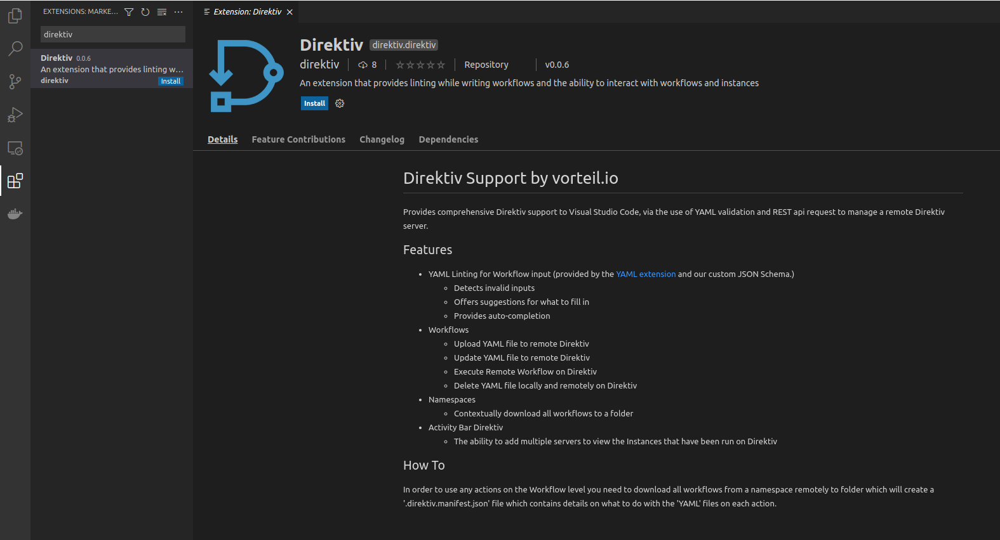
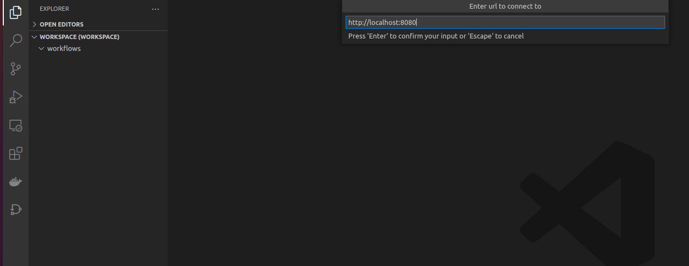
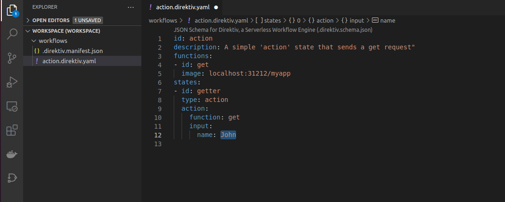

# Development Environment

To improve isolate and workflows development it is recommended to setup a local development environment. This section explains how to setup the development environment. Details about developing custom isolates is described in <a href="walkthrough/making-isolates.html">this section</a>.

### Running direktiv

Setting up a development direktiv instance on a local machine is pretty simple. Assuming docker is installed, run the folowing command:


```sh
docker run --privileged -p 8080:80 -p 31212:31212 -d --name direktiv vorteil/direktiv-kube
```

This command starts direktiv as container 'direktiv'. The initial boot-time will take a few minutes. The progress can be followed with:

```sh
docker logs direktiv -f
```

Once all pods reach 'running' status, direktiv is ready and the URL `http://localhost:8080/api/namespaces/` is accessible.

Using the instructions detailed so far, the included database is deleted each time the container is restarted. In some scenarios, it may be desirable to retain data such as workflows, secrets, and variables between restarts. The direktiv container stores database data in */tmp/pg*. This directory can be mapped to a local directory, which is demonstrated in the following command. Persistent storage is enabled by setting the value of the `PERSIST` environment variable to `true`.

```sh
docker run --privileged -p 8080:80 -p 31212:31212 --env PERSIST=true  -ti -v /tmp/pg:/tmp/pg vorteil/direktiv-kube
```

### Docker registry

Direktiv pulls containers from a registry and runs them as isolates. For development purposes the direktiv docker container comes with a registry installed. It is accessible on localhost:31212.

To test the local repository the golang example from direktiv-apps can be used:

```sh
git clone https://github.com/vorteil/direktiv-apps.git

docker build direktiv-apps/examples/golang/ -t localhost:31212/myapp

docker push localhost:31212/myapp

# confirm upload
curl http://localhost:31212/v2/_catalog

```

To use it we need to create a namespace and a workflow.

```sh
# create namespace 'test'
curl -X POST http://localhost:8080/api/namespaces/test

# create the workflow file
cat > helloworld.yml <<- EOF
id: action
description: A simple 'action' state that sends a get request"
functions:
- id: get
  image: localhost:31212/myapp
states:
- id: getter
  type: action
  action:
    function: get
    input:
      name: John
EOF

# upload workflow
curl -X POST -H "Content-Type: text/yaml" --data-binary @helloworld.yml http://localhost:8080/api/namespaces/test/workflows

# execute workflow (initial call will be slightly slower than subsequent calls)
curl http://localhost:8080//api/namespaces/test/workflows/action/execute?wait=true

```

### Visual Studio Code (IDE)

Although developing workflows with the web UI is easy, direktiv's Visual Studio Code extension can be used to make local workflow development faster and more convenient.

#### Install Extension

The direktiv extension is published on the marketplace and a simple search for 'direktiv' in the marketplace should return one result. After pressing 'Install' the extension is ready.

The direktiv extension is available on the Visual Studio Code extension marketplace. Simply searching for 'direktiv' should return the correct result. After clicking on 'Install' the extension is ready for use.

<p align=center>

</p>

#### Adding workspace

To connect a local folder in your workspace to direktiv, right click a folder and click the 'Download Workflows' button in the context menu. When prompted, enter `http://localhost:8080` as the Connection URL and `test` as a namespace.

<p align=center>

</p>

The selected folder should now contain the workflow created previously.

<p align=center>

</p>

#### Running workflows

It is now possible to edit workflows through Visual Studio Code (eg. changing the value of the `name` field to `Hello`). When the file is saved, only the local copy of the workflow is affected. The direktiv extension provides a few keyboard shorcuts for common actions:

- Save and Upload (Ctrl+Alt+S)
- Save, Upload and Execute (Ctrl+Alt+X)
- Execute (Shift+Alt+X)

For example, pressing Ctrl-Alt-X will save the local copy of the workflow, update the remote version of the workflow, and execute it. An 'instance' tab is then opened inside of Visual Studio Code that presents the instance logs in real-time. To manually locate instance logs, click on the direktiv logo on the sidebar panel. Click on the `...` icon in the top-right corner of the `DIREKTIV: INSTANCES` panel, and enter `http://localhost:8080`. When prompted for a namespace, enter `test`. Press `enter` one more time to skip past the final prompt. 

To view instance output, right-click on one of the listed instances and select `Get Instance Output` from the context menu.

<p align=center>

</p>
