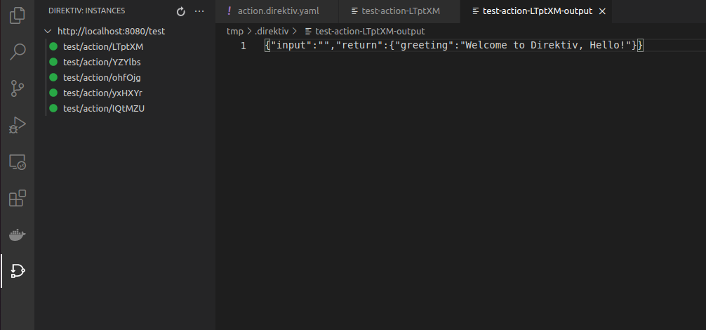

# Development Environment

To improve isolate and workflows development it is recommended to setup a local development environment. This section explains how to setup the development environment. The details about developing custom isolates is described in <a href="walkthrough/making-isolates.html">this section</a>.

### Running direktiv

Setting up a development direktiv instance on a local machine is pretty simple. Assuming docker is installed, run the folowing command:


```sh
docker run --privileged -p 8080:80 -p 31212:31212 -d --name direktiv vorteil/direktiv-kube
```

This command starts direktiv as container 'direktiv'. The initial boot-time will take a few minutes. The progress can be followed with:

```sh
docker logs direktiv -f
```

After all pods showing the status 'running' direktiv is ready and the URL **http://localhost:8080/api/namespaces/** is accessible.

With this setting the database is getting deleted with every restart. It might be desirable to keep workflows, secrets and variables after a restart. The container stores the database data in */tmp/pg*. This directory can be mapped to a local directory like in the following command. The environment variable *PERSIST* enables persistent storage.

```sh
docker run --privileged -p 8080:80 -p 31212:31212 --env PERSIST=true  -ti -v /tmp/pg:/tmp/pg vorteil/direktiv-kube
```

### Docker registry

Direktiv pulls containers from a registry and runs them as isolates. For development purposes the direktiv docker container comes with a registry installed. It is accessible on localhost:31212.


To test the local repository the golang example from direktiv-apps can be used:

```sh
git clone https://github.com/vorteil/direktiv-apps.git

docker build direktiv-apps/examples/golang/ -t localhost:31212/myapp

docker push localhost:31212/myapp

# confirm upload
curl http://localhost:31212/v2/_catalog

```

To use it we need to create a namespace and a workflow.

```sh
# create namespace 'test'
curl -X POST http://localhost:8080/api/namespaces/test

# create the workflow file
cat > helloworld.yml <<- EOF
id: action
description: A simple 'action' state that sends a get request"
functions:
- id: get
  image: localhost:31212/myapp
states:
- id: getter
  type: action
  action:
    function: get
    input:
      name: John
EOF

# upload workflow
curl -X POST -H "Content-Type: text/yaml" --data-binary @helloworld.yml http://localhost:8080/api/namespaces/test/workflows

# execute workflow, initial call will be slightly slower than subsequent calls
curl http://localhost:8080//api/namespaces/test/workflows/action/execute?wait=true

```

### Visual Studio Code (IDE)

Although developing workflows with web UI is easy diektiv's Visual Studio Code extension can be used to make local workflow development faster and convenient.

#### Install Extension

The direktiv extension is published on the marketplace and a simple search for 'direktiv' in the marketplace should return one result. After pressing 'Install' the extension is ready.

<p align=center>

</p>

#### Adding workspace

To connect a folder in your workspace use "Download Workflows" ni the context menu of the folder and enter 'http://localhost:8080' as connection url and 'test' as namespace.

<p align=center>

</p>

After pressing return the workflow created in previous steps appears.

<p align=center>

</p>

#### Running workflow

Now the workflow can be changed, e.g. the name of the input from 'John' to 'Hello'. The extension provides a few hotkeys:

- Save and Upload (ctrl+alt+s)
- Save, Upload and Execute (ctrl+alt+x)
- Execute (shift+alt+x)

After pressing ctrl+alt+x the workflow is getting executed and the logs are presented in a new tab in Visual Studio Code.  

The output of the workflow can be accessed via the direktiv icon in the left navigation. Add the remote server and select "Get Instance Output" from the context of the workflow instance.

<p align=center>

</p>
