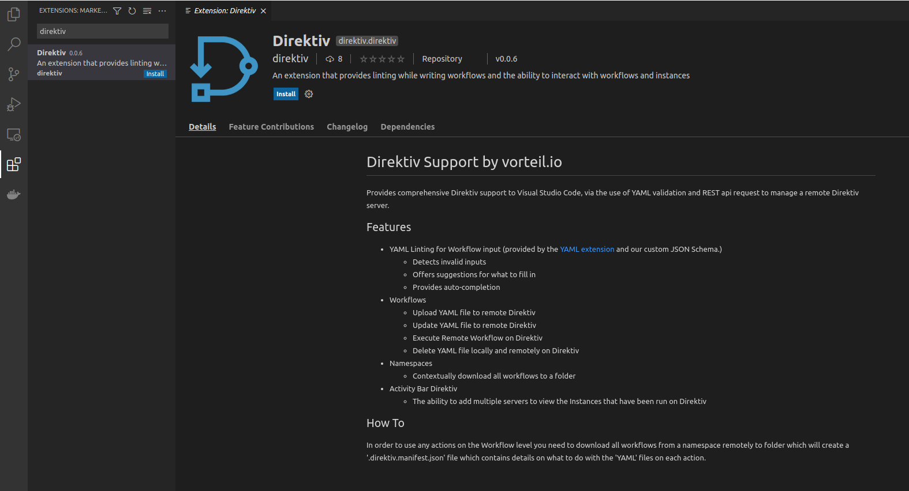
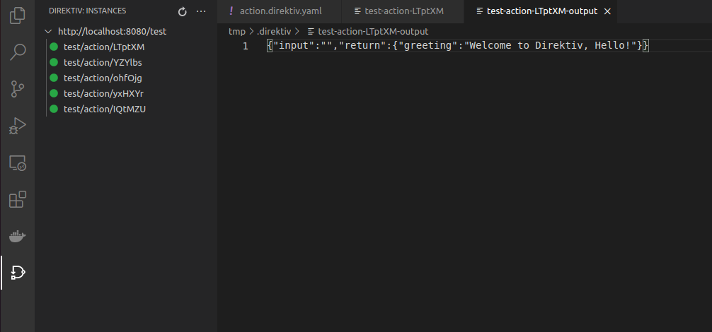

# Visual Studio Code (IDE)

Although developing workflows with the web UI is easy, direktiv's Visual Studio Code extension can be used to make local workflow development faster and more convenient.

## Install Extension

The direktiv extension is published on the marketplace and a simple search for 'direktiv' in the marketplace should return one result. After pressing 'Install' the extension is ready.

The direktiv extension is available on the Visual Studio Code extension marketplace. Simply searching for 'direktiv' should return the correct result. After clicking on 'Install' the extension is ready for use.

## Adding workspace

To connect a local folder in your workspace to direktiv, right click a folder and click the 'Download Workflows' button in the context menu. When prompted, enter `http://localhost:8080` as the Connection URL and `test` as a namespace.

The selected folder should now contain the workflow created previously.

## Running workflows

It is now possible to edit workflows through Visual Studio Code (eg. changing the value of the `name` field to `Hello`). When the file is saved, only the local copy of the workflow is affected. The direktiv extension provides a few keyboard shorcuts for common actions:

- Save and Upload (Ctrl+Alt+S)
- Save, Upload and Execute (Ctrl+Alt+X)
- Execute (Shift+Alt+X)

For example, pressing Ctrl-Alt-X will save the local copy of the workflow, update the remote version of the workflow, and execute it. An 'instance' tab is then opened inside of Visual Studio Code that presents the instance logs in real-time. To manually locate instance logs, click on the direktiv logo on the sidebar panel. Click on the `...` icon in the top-right corner of the `DIREKTIV: INSTANCES` panel, and enter `http://localhost:8080`. When prompted for a namespace, enter `test`. Press `enter` one more time to skip past the final prompt. 

To view instance output, right-click on one of the listed instances and select `Get Instance Output` from the context menu.

