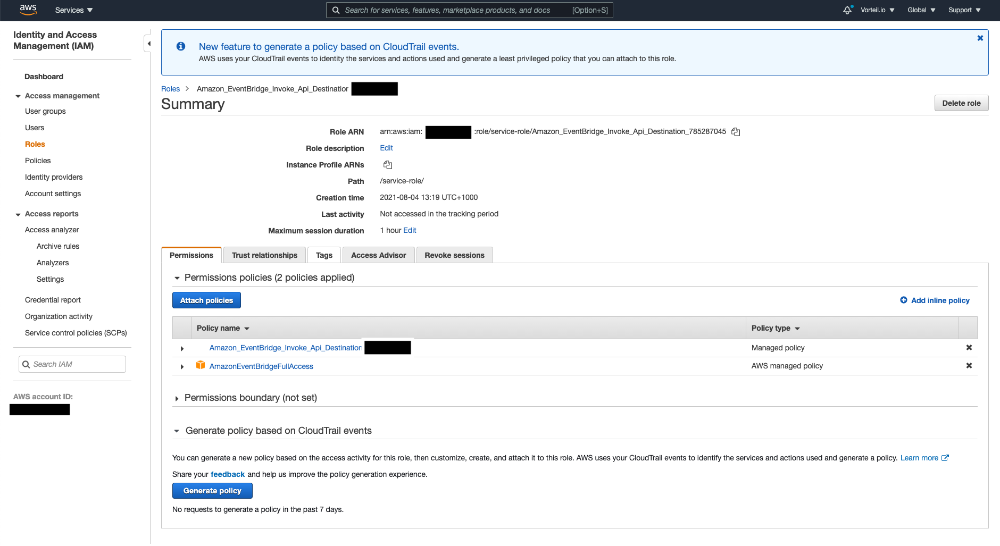

# Amazon EventBridge

We're going to go through the process of setting up a rule for 'ec2' to send events to our Direktiv service. This explains how to create an api destination and transform the aws event input to cloud event format. 

Note: the below tutorial assumes that the user has already created the IAM role for the EventBridge API integration as described in [Amazon EventBridge User Guide](https://docs.aws.amazon.com/eventbridge/latest/userguide/eb-use-identity-based.html)

From the Role create above - keep the Role Arn details as it is needed in the final step. A screenshot is shown below:

<p align=center>

</p>


## Create a rule

```sh
aws events put-rule --name "direktiv-rule" --event-pattern "{\"source\": [\"aws.ec2\"]}"
```

The following output should appear (make sure you hold onto the ARN as it is used further down to attach a target to the rule):

```json
{
    "RuleArn": <RULE_ARN> 
}
```

## Create a connection

After creating an Authorization token from the Direktiv interface, create the connection using the token as follow:

```sh
aws events create-connection --name direktiv-connection --authorization-type API_KEY --auth-parameters "{\"ApiKeyAuthParameters\": {\"ApiKeyName\":\"Authorization\", \"ApiKeyValue\":\"Bearer <DIREKTIV_ACCESS_TOKEN>\""}}
```

Upon creating the connection the following output from the CLI should appear.

```json
{
    "ConnectionArn": <CONNECTION_ARN>,
    "ConnectionState": "AUTHORIZED",
    "CreationTime": "2021-08-04T03:25:49+00:00",
    "LastModifiedTime": "2021-08-04T03:25:49+00:00"
}
```

We will need to use the connection arn in the next command.

## Create an Api-Destination

```sh
aws events create-api-destination --name direktiv-api --connection-arn <CONNECTION_ARN> --invocation-endpoint https://<DIREKTIV_URL>/api/namespaces/<NAMESPACE>/event --http-method POST
```

The output should resemble this:

```json
{
    "ApiDestinationArn": <API_ARN>,
    "ApiDestinationState": "ACTIVE",
    "CreationTime": "2021-08-04T03:26:18+00:00",
    "LastModifiedTime": "2021-08-04T03:26:18+00:00"
}
```

## Put Targets to the AWS EventBridge Rule

Adding the targets to the EventBridge rule also requires us to define an Input Path and Input Template.

```sh
aws events put-targets --rule direktiv-rule --targets '[ { "Id": "direktiv-api", "RoleArn": <ROLE_ARN>, "Arn": <API_ARN>, "InputTransformer": { "InputPathsMap": { "source": "$.source", "type": "$.source", "data": "$.detail" },  "InputTemplate": "{ \"source\": \"<source>\", \"type\": \"<type>\", \"data\": \"<data>\", \"specversion\": \"1.0\" }" } } ]'
```

The output (if successful) below:

```json
{
    "FailedEntryCount": 0,
    "FailedEntries": []
}
```

### Input Path Map Example

Input Path Map captures the EventBridge event so we can easily filter into a cloud event to send to Direktiv

```json
{
    "source": "$.source",
    "type": "$.source",
    "data": "$.detail"
}
```

### Input Template Example

The Input Template allows you to spec out what you want the JSON to look like parsing the values from the input path.

```json
{
  "type": <type>,
  "source": <source>,
  "data":  <data>,
  "specversion": "1.0"
}
```

So now when you change the state of an instance on EC2 a workflow will be triggered on Direktiv if it is listening to 'aws.ec2'.

## Testing

Create this simple workflow that gets executed when it receives a cloud-event of a specific type.

```yaml
id: listen-for-event
description: Listen to a custom cloud event
start:
  type: event
  state: helloworld
  event:
    type: aws.ec2
states:
  - id: helloworld
    type: noop
    transform: 'jq({ result: . })'
```

