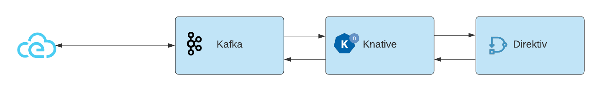
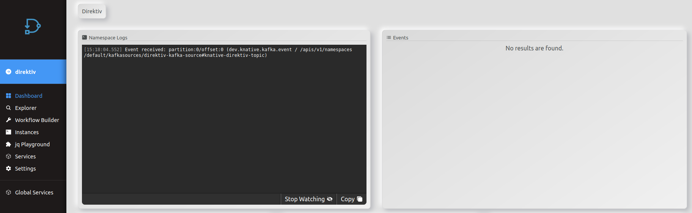

## Kafka, Knative and Direktiv

In this example we will generate an event in Kafka, consume it in Direktiv via Knative and publish a new event back to Knative.

<p align="center">

</p>

### Install Knative

The knative installation is simply applying two yaml files to the cluster.

*Install Knative*

```console
kubectl apply -f https://github.com/knative/eventing/releases/download/v0.26.1/eventing-crds.yaml

kubectl apply -f https://github.com/knative/eventing/releases/download/v0.26.1/eventing-core.yaml
```

After successful installation there are two pods runnning:

```console
kubectl get pods -n knative-eventing

NAME                                   READY   STATUS    RESTARTS   AGE
eventing-controller-7b466b585f-76fd4   1/1     Running   0          7s
eventing-webhook-5c8886cb56-q2h7r      1/1     Running   0          7s
```

### Kafka Setup

If there is no Kafka instance available in the environment, it is easy to setup and configure Kafka with [Strimzi](https://strimzi.io/quickstarts/). This is a two step process: installing the kafka operator and creating the Kafka cluster itself.

*Install Operator*
```console
kubectl create namespace kafka
kubectl create -f 'https://strimzi.io/install/latest?namespace=kafka' -n kafka
```

*Create Kafka Cluster*
```console
kubectl apply -f https://strimzi.io/examples/latest/kafka/kafka-persistent-single.yaml -n kafka

# wait for cluster to be ready
kubectl wait kafka/my-cluster --for=condition=Ready --timeout=300s -n kafka
```

### Create Kafka Topics

In this example we will consume an event from one channel and publish to a second channel. Therefore we need two new topics to subscribe and publish to.

```yaml
cat <<-EOF | kubectl apply -f -
---
  apiVersion: kafka.strimzi.io/v1beta2
  kind: KafkaTopic
  metadata:
    name: knative-direktiv-topic
    namespace: kafka
    labels:
      strimzi.io/cluster: my-cluster
  spec:
    partitions: 3
    replicas: 1
    config:
      retention.ms: 7200000
      segment.bytes: 1073741824
EOF

cat <<-EOF | kubectl apply -f -
---
  apiVersion: kafka.strimzi.io/v1beta2
  kind: KafkaTopic
  metadata:
    name: receiver-topic
    namespace: kafka
    labels:
      strimzi.io/cluster: my-cluster
  spec:
    partitions: 3
    replicas: 1
    config:
      retention.ms: 7200000
      segment.bytes: 1073741824
EOF

# test if topics have been created
kubectl get kafkatopics.kafka.strimzi.io  -n kafka
```

### Create Broker

In Knative there are different broker and channel combinations available. Here we will use Kafka as a Broker. To install Kafka as Knative broker there needs to be a Kafka broker controller and the implementation itself.

*Install Kafka Broker Controller*
```yaml
kubectl apply --filename https://github.com/knative-sandbox/eventing-kafka-broker/releases/download/v0.26.0/eventing-kafka-controller.yaml
kubectl apply --filename https://github.com/knative-sandbox/eventing-kafka-broker/releases/download/v0.26.0/eventing-kafka-broker.yaml
```

With these installed the actual broker can be created. It requires a configmap to nominate the Kafka bootstrap server(s) and the broker yaml file to create the actual broker.

*Kafka Broker Configuration*
```yaml
cat <<-EOF | kubectl apply -f -
---
apiVersion: v1
kind: ConfigMap
metadata:
  name: kafka-broker-config
  namespace: knative-eventing
data:
  default.topic.partitions: "10"
  default.topic.replication.factor: "1"
  bootstrap.servers: "my-cluster-kafka-bootstrap.kafka:9092"
EOF
```

*Kafka Broker*
```yaml
cat <<-EOF | kubectl apply -f -
---
apiVersion: eventing.knative.dev/v1
kind: Broker
metadata:
  annotations:
    eventing.knative.dev/broker.class: Kafka
  name: default
  namespace: default
spec:
  config:
    apiVersion: v1
    kind: ConfigMap
    name: kafka-broker-config
    namespace: knative-eventing
EOF
```

An successful installation creates a broker in ready state.

```console
kubectl get brokers.eventing.knative.dev

NAME      URL                                                                              AGE   READY   REASON
default   http://kafka-broker-ingress.knative-eventing.svc.cluster.local/default/default   3s    True    
```

### Kafka Source

The basic Knative and Kafka setup is finished and the sources and sinks to integrate the components are the last components missing.

*Install Kafka Source Implementation*
```console
kubectl apply -f https://storage.googleapis.com/knative-nightly/eventing-kafka/latest/source.yaml
```

Creating a Kafka source requires to provide the bootstrap server and the topic to subscribe to. The topic *knative-direktiv-topic* was created at the beginning of this example and will be the channel to ingest events into Direktiv. The *sink* value configures this source to send all events coming from this channel to the Kafka broker.

*Create Kafka Source*
```yaml
cat <<-EOF | kubectl apply -f -
---
apiVersion: sources.knative.dev/v1beta1
kind: KafkaSource
metadata:
  name: direktiv-kafka-source
spec:
  consumerGroup: knative-group
  bootstrapServers:
  - my-cluster-kafka-bootstrap.kafka:9092 # note the kafka namespace
  topics:
  - knative-direktiv-topic
  sink:
    ref:
      apiVersion: eventing.knative.dev/v1
      kind: Broker
      name: default
EOF
```

This yaml creates the source and it is ready to consume events.

```console
kubectl get kafkasources.sources.knative.dev

NAME                    TOPICS                       BOOTSTRAPSERVERS                            READY   REASON   AGE
direktiv-kafka-source   ["knative-direktiv-topic"]   ["my-cluster-kafka-bootstrap.kafka:9092"]   True             10s
```

With this source Knative can receive events but it requires a trigger to have another system consume the event. The setup of source, broker and trigger decouples the systems involved in this architecture. The folllwing yaml creates such a trigger. Because there is a [trigger filter](https://knative.dev/docs/eventing/broker/triggers/) defined this trigger consumes all events of type *dev.knative.kafka.event* and forwards it to Direktiv's *direktiv-eventing* service. The *uri* value specifies the target namespace in Direktiv.

```yaml
cat <<-EOF | kubectl apply -f -
---
apiVersion: eventing.knative.dev/v1
kind: Trigger
metadata:
  name: direktiv-in
  namespace: default
spec:
  broker: default
  filter:
    attributes:
      type: dev.knative.kafka.event
  subscriber:
    ref:
      apiVersion: v1
      kind: Service
      name: direktiv-eventing
    uri: /direktiv
EOF
```

This setup will already send events to a namespace called *direktiv* if data arrives at the *knative-direktiv-topic* topic in Kafka. This can be easily tested but the direktiv namespace has to exist in Direktiv. To test it we start a pod which connects to the topic.

```console
kubectl -n kafka run kafka-producer -ti --image=quay.io/strimzi/kafka:0.26.0-kafka-3.0.0 --rm=true --restart=Never -- bin/kafka-console-producer.sh --broker-list my-cluster-kafka-bootstrap.kafka:9092 --topic knative-direktiv-topic
```

After running the pod add JSON into the command prompt, e.g. *{}*. This sends the JSON object to Kafka. Knative's broker will pick it up and executes the trigger for direktiv. The event will appear on the *direktiv* namespace dashboard.

<p align="center">

</p>

### Direktiv Source

To connect Direktiv back to Knative again we need to install *[direktiv-knative-source](https://github.com/vorteil/direktiv-knative-source)*. This source listens to events generated in Direktiv and pushes them to Knative. In this example the message is pushed back to the broker. The required argument for this source is the direktiv URI within the cluster, e.g. direktiv-flow.default:3333.

*Direktiv Source*

```yaml
cat <<-EOF | kubectl apply -f -
---
apiVersion: sources.knative.dev/v1
kind: ContainerSource
metadata:
  name: direktiv-source
spec:
  template:
    spec:
      containers:
        - image: vorteil/direktiv-knative-source
          name: direktiv-source
          args:
            - --direktiv=direktiv-flow.default:3333
  sink:
    ref:
      apiVersion: eventing.knative.dev/v1
      kind: Broker
      name: default
EOF
```

### Kafka Sink

The last task left is installing a Kafka sink and trigger to send events coming from Direktiv to the broker.

*Installing Kafka Sink Implementation*
```console
kubectl apply -f https://github.com/knative-sandbox/eventing-kafka-broker/releases/download/v0.26.0/eventing-kafka-sink.yaml
```

*Creating Kafka Sink*
```yaml
cat <<-EOF | kubectl apply -f -
---
apiVersion: eventing.knative.dev/v1alpha1
kind: KafkaSink
metadata:
  name: direktiv-kafka-sink
  namespace: default
spec:
  topic: receiver-topic
  bootstrapServers:
   - my-cluster-kafka-bootstrap.kafka:9092
EOF
```

The following yaml configures the trigger for Kafka. It is important to add a filter for this trigger. In this case the trigger fires if the type of the cloudevent is *myevent*.

*Creating Kafka Trigger*
```yaml
cat <<-EOF | kubectl apply -f -
---
apiVersion: eventing.knative.dev/v1
kind: Trigger
metadata:
  name: direktiv-receive
  namespace: default
spec:
  broker: default
  filter:
    attributes:
      type: myevent
  subscriber:
    ref:
      apiVersion: eventing.knative.dev/v1alpha1
      kind: KafkaSink
      name: direktiv-kafka-sink
EOF
```

### Workflow

After all these components are installed and connected we need to create a workflow in the *direktiv* namespace. To see the full configuration we will create flow which listens to Knative events, extracts the data and sends it back to Knative and eventually Kafka.

```yaml
start:
  type: event
  state: tellme
  event:
    type: dev.knative.kafka.event
states:
- id: tellme
  type: generateEvent
  event:
    type: myevent
    source: Direktiv
    data:
      x: jq(."dev.knative.kafka.event".data)
```

A second receiver pod is needed to see the events coming from Direktiv . It listens to topic *receiver-topic* which was created at the beginning of this tutorial. If data is put on the *knative-direktiv-topic* it will appear in this receiver topic.

```console
kubectl -n kafka run kafka-consumer -ti --image=quay.io/strimzi/kafka:0.26.0-kafka-3.0.0 --rm=true --restart=Never -- bin/kafka-console-consumer.sh --bootstrap-server my-cluster-kafka-bootstrap:9092 --topic receiver-topic --from-beginning
```
