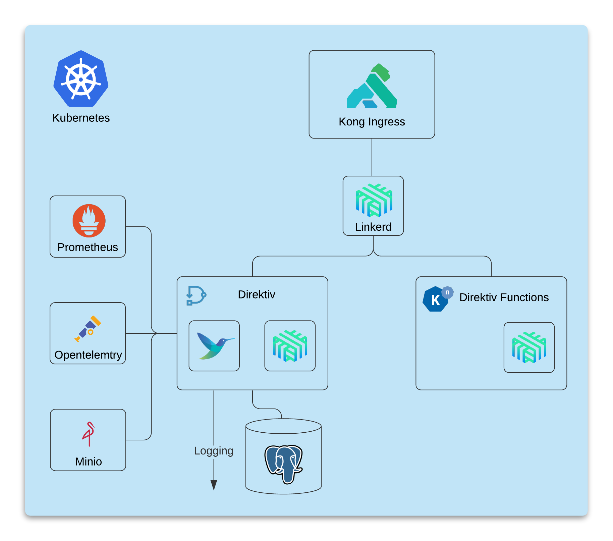

# Installation

Installing Direktiv can be done with a simple [helm](https://helm.sh/) install command. The only requirements for a basic installation is a PostgreSQL database and a kubernetes cluster. Direktiv has been tested with Kubernetes and PostgreSQL offerings of the major cloud providers.

```shell
$ helm repo add direktiv https://charts.direktiv.io
$ helm install knative direktiv/knative

kubectl create namespace direktiv
helm install -n direktiv direktiv direktiv/direktiv  
```

The following diagram shows a high-level architecture of Direktiv and the required and optional components.

<p align="center">

</p>

Although a few simple helm command will install a working Direktiv instance there can be other requirements the following list will explain how to install and configure the individual components. It is possible to deploy them in an order of choice it is recommended to follow the suggested order listed below. 

There is also a [quick installation guide](summary) and a docker image for testing:

#### Run docker image
```console
docker run --privileged -p 8080:80 -ti vorteil/direktiv-kube
```

