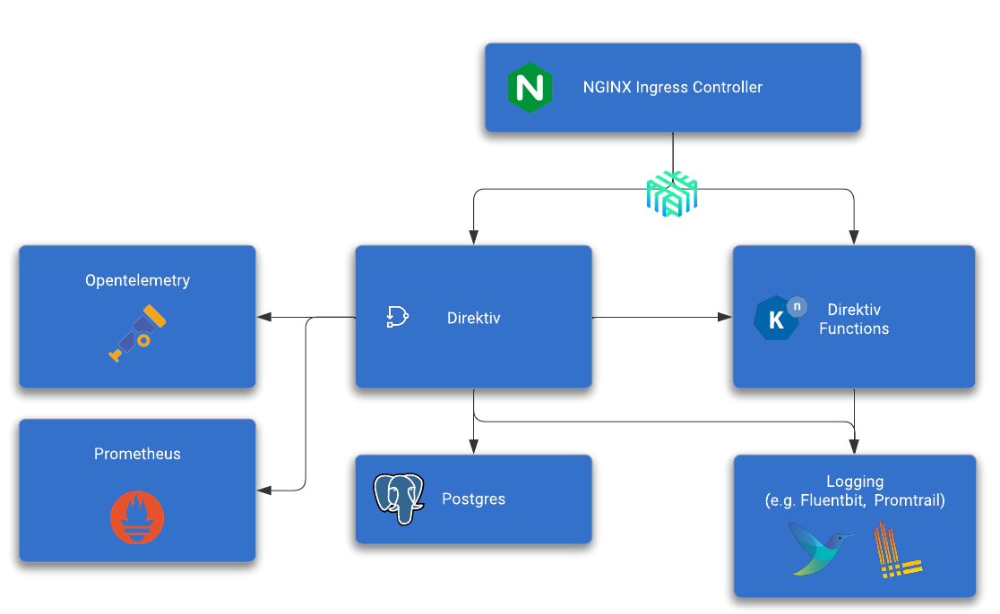

# Installation

Installing Direktiv can be done with a simple [helm](https://helm.sh/) install command. The only requirements for a basic installation is a [PostgreSQL](database) database and a [kubernetes](kubernetes) cluster. Direktiv has been tested with Kubernetes and PostgreSQL offerings of all major cloud providers.

```shell
kubetcl create ns direktiv-services-direktiv

helm repo add direktiv https://chart.direktiv.io
helm install knative direktiv/knative

helm install -n direktiv --create-namespace direktiv direktiv/direktiv  
```

The following diagram shows a high-level architecture of Direktiv and the required and optional components.

<p align="center">

</p>

Although a few simple helm command will install a working Direktiv instance there can be other requirements. The following list will explain how to install and configure the individual components. It is possible to deploy them in an order of choice but it is recommended to follow the suggested order listed below.

There is also a [quick installation guide](summary) and a docker image for testing:

#### Run docker image
```console
docker run --privileged -p 8080:80 -ti direktiv/direktiv-kube
```

The docker images has addtional environment variables which can add additional functionality:

- APIKEY: Set an API key for the application
- HTTPS_PROXY: Sets the HTTPS_PROXY environment variable
- HTTP_PROXY: Sets the HTTP_PROXY environment variable
- NO_PROXY: Sets the NO_PROXY environment variable
- EVENTING: Enables Knative eventing
- DEBUG: Prints k3s output to stdout

*Example*
```console
docker run -e APIKEY=123 --privileged -p 8080:80 -ti direktiv/direktiv-kube
```
