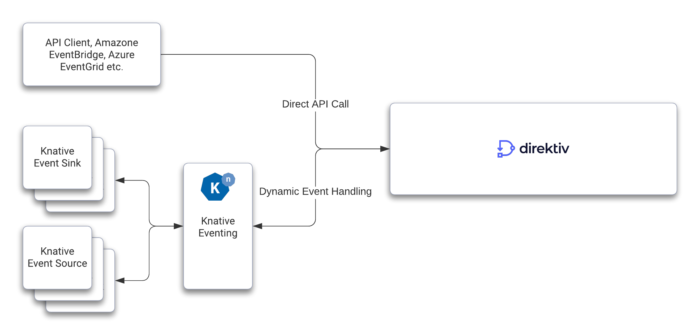

# Events

Direktiv utilizes the [HTTP Protocol Binding for CloudEvents](https://github.com/cloudevents/spec/blob/main/cloudevents/bindings/http-protocol-binding.md), and offers two distinct ways to produce and consume events. The easiest approach is by using Direktiv's API directly in order to route your desired events. However, if you require more flexibility, Knative can assist with a more powerful and dynamic approach when it comes to eventing. What type of integration is ideal depends on which use cases are meant to be addressed by Direktiv. Independent from this integration approach system internal events within Direktiv are always supported.



## Event API

The event API provides direct access to Direktiv's eventing system. The general API path is `/api/namespaces/{namespace}/broadcast`. Following the cloud-event specification events can be send to Direktiv in three different formats. 

!!! info "Event ID"
        The specification requires an event ID. Direktiv generates a random ID if not provided by the client.

### Binary Content Mode

Th binary content mode uses headers to describe the event metadata with a "ce-" prefix and allows for efficient transfer and without transcoding effort. The header "content-type" must be set to the content-type of the body of the event.

```
POST /api/namespaces/{namespace}/broadcast HTTP/1.1
Host: direktiv.io
ce-specversion: 1.0
ce-type: com.example.event
ce-id: 1234-1234-1234
ce-source: /mycontext/subcontext
Content-Type: application/json; charset=utf-8

{
   "hello": "world"
}
```

### Structured Content Mode

In structured mode the whole cloudevent is in the payload. The content-type header needs to be set to "application/cloudevents+json". 

```json
{
    "specversion" : "1.0",
    "type" : "com.github.pull_request.opened",
    "source" : "https://github.com/cloudevents/spec/pull",
    "subject" : "123",
    "id" : "A234-1234-1234",
    "datacontenttype" : "text/xml",
    "data" : "<much wow=\"xml\"/>"
}
```

### Batched Content Mode

In batch mode multiple events can be send to direktiv. The content-type has to be "application/cloudevents-batch+json" and the body is a JSON array of cloud events.

```json
[
    {
    "specversion" : "1.0",
    "type" : "com.github.pull_request.opened",
    "source" : "https://github.com/cloudevents/spec/pull",
    "subject" : "123",
    "id" : "C234-1234-1234",
    "datacontenttype" : "text/xml",
    "data" : "<much wow=\"xml\"/>"
    },
    {
    "specversion" : "1.0",
    "type" : "com.github.pull_request.opened",
    "source" : "https://github.com/cloudevents/spec/pull",
    "subject" : "123",
    "id" : "B234-1234-1234",
    "datacontenttype" : "text/xml",
    "data" : "<much wow=\"xml\"/>"
    }
]
```

### Other Data

If unknown data arrives at the API endpoint Direktiv does not drop the data but converts it into a cloud event. The value for `type` is set to `noncompliant` and `source` to `unknown`. The payload of the original requets will be base64 encoded and added as `data_base64` to the event. If the content type can be guessed or is provided in the header it will be part of the cloud event as well.

```json
{
  "noncompliant": {
    "data_base64": "aHR0cHM6Ly93d3cueW91dHViZS5jb20vd2F0Y2g/dj1kUXc0dzlXZ1hjUQ==",
    "datacontenttype": "text/plain",
    "error": "unknown Message encoding",
    "id": "60290f4b-3971-411a-b824-73b60eb8b72d",
    "source": "unknown",
    "specversion": "1.0",
    "type": "noncompliant"
  }
}
```

## Events in Flows

Events in a Direktiv flow can be a [start condition](../spec/workflow-yaml/starts.md#startdefinition) and initiate a flow or a workflow can [wait for an event during flow execution](../spec/workflow-yaml/consume-event.md). Direktiv can wait for single events or on [AND](../spec/workflow-yaml/events-and.md) and [OR](../spec/workflow-yaml/events-xor.md) combinations of events. 

### Event Start Type Example

The following is an example of a simple [start condition](../spec/workflow-yaml/starts.md#startdefinition) for a Direktiv flow. A start condition requires the type and additional `context` values can be provided. If context values are defined the cloud event has to match the context attribute. For matching [glob](https://en.wikipedia.org/wiki/Glob_(programming)) values can be used. 

```yaml
start:
  type: event
  state: helloworld
  event:
    type: io.direktiv.myevent
    context:
      myvalue: my*
states:
- id: helloworld
  type: noop
  log: jq(.)
```

The above example flow would trigger if the following cloud event would arrive:

```json
{
    "specversion" : "1.0",
    "type" : "io.direktiv.myevent",
    "source" : "https://github.com/cloudevents/spec/pull",
    "subject" : "123",
	"myvalue": "mydata"
}
```

Because the defintion uses a glob pattern valid values fo `myvalue` could be everything starting with `my`. If the attribute is missing or does not start with `my` the workflow would not trigger.

### Events in Flow Example

Waiting for events within a flow is similar to a start definition except the `context` can be used to "link" flows to each other via context attributes in events. Additionally it can handle timeouts if an event has not been received within a certain time. 

```yaml
states:

- id: wait-event
  type: consumeEvent
  timeout: PT1M
  event:
    type: io.direktiv.myevent
    context:
      customer: jq(.customer)
  catch: 
  - error: "direktiv.cancels.timeout.soft"
    transition: timedout

- id: timedout
  type: noop
  log: this event timed out
```


