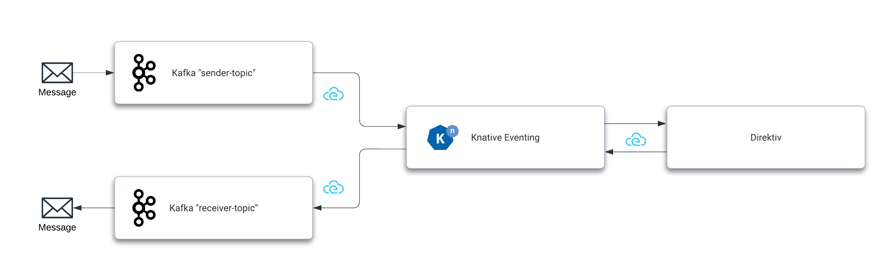
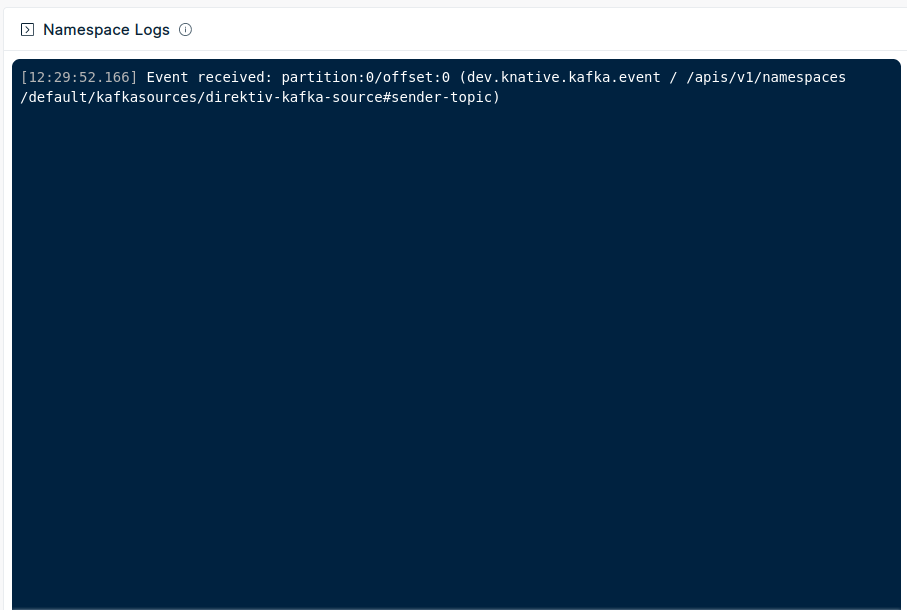

This example uses Kafka as Knative event broker and event source and sink as well. After receiving a message from Kafka, Knative forwards it to Direktiv which subsequently initiates a flow and publishes an event back to Knative which will broker the event to a receive topic in Kafka. To run this example the following steps are required:

- [Installing Kafka](#installing-kafka)
- [Installing Knative with Kafka](#knative-with-kafka)
- [Configure Kafka Source](#configuring-kafka-source)
- [Configure Direktiv Source](#configuring-direktiv-source)
- [Configuring Kafka Sink](#configuring-kafka-sink)
- [Flow](#flow)

!!! warning "Example Versions"
    The version numbers in this example might have changed over time. Please make sure to update them accordingly if required.



## Installing Kafka

To enable Knative Eventing in a production environment, Knative requires the installation of an event broker. By setting up triggers and subscriptions, Knative brokers like RabbitMQ or Kafka can build an event mesh architecture. Here we will be using Kafka and the [Strimzi Operator](https://strimzi.io) for the installation. This is a two-step process, installing the Kafka operator and creating the Kafka cluster itself.

```sh title="Installing Strimzi Operator"
kubectl create namespace kafka
kubectl create -f 'https://strimzi.io/install/latest?namespace=kafka' -n kafka
kubectl wait --for=condition=ready pod -l name=strimzi-cluster-operator -n kafka --timeout=300s
```

!!! warning "Kafka Installation"
    The Kafka installation instructions provided here is just an example and can not be used as-is
    in production environments. Please go to https://strimzi.io for full documentation. 

After the operator is running the following command enables KRaft for the operator. This allows an installation without Zookeeper and should simplify this setup.

```sh title="Enable KRaft"
kubectl -n kafka set env deployment/strimzi-cluster-operator STRIMZI_FEATURE_GATES=+UseKRaft
kubectl wait --for=condition=ready pod -l name=strimzi-cluster-operator -n kafka --timeout=300s
```

The following command will create the actual Kafka cluster which will be used in this example. 

```yaml title="Create Kafka Instance"
cat <<-EOF | kubectl apply -f -
---
apiVersion: kafka.strimzi.io/v1beta2
kind: Kafka
metadata:
  name: my-cluster
  namespace: kafka
spec:
  kafka:
    version: 3.4.0
    replicas: 1
    listeners:
      - name: plain
        port: 9092
        type: internal
        tls: false
      - name: tls
        port: 9093
        type: internal
        tls: true
    config:
      offsets.topic.replication.factor: 1
      transaction.state.log.replication.factor: 1
      transaction.state.log.min.isr: 1
      default.replication.factor: 1
      min.insync.replicas: 1
      inter.broker.protocol.version: "3.4"
    storage:
      type: ephemeral
  zookeeper:
    replicas: 1
    storage:
      type: ephemeral
EOF
```

## Knative with Kafka

To use Kafka as the underlying mechanism for message brokering Knative needs to be configured during installation. The YAML here will create Knative Eventing instance with the required settings.

```yaml title="Knative Eventing with Kafka"
cat <<-EOF | kubectl apply -f -
---
apiVersion: v1
kind: Namespace
metadata:
  name: knative-eventing
---
apiVersion: operator.knative.dev/v1beta1
kind: KnativeEventing
metadata:
  name: knative-eventing
  namespace: knative-eventing
spec:
  config:
    config-br-default-channel:
      channel-template-spec: |
        apiVersion: messaging.knative.dev/v1beta1
        kind: KafkaChannel
        spec:
          numPartitions: 6
          replicationFactor: 1
    default-ch-webhook:
      default-ch-config: |
        clusterDefault:
          apiVersion: messaging.knative.dev/v1beta1
          kind: KafkaChannel
          spec:
            numPartitions: 10
            replicationFactor: 1
EOF
```

This installation requires the Knative Kafka controller and data plane as well. This can be installed with two `kubectl` commands.

```sh title="Knative Kafka Dependencies"
kubectl apply --filename https://github.com/knative-sandbox/eventing-kafka-broker/releases/download/knative-v1.9.3/eventing-kafka-controller.yaml
sleep 3
kubectl apply --filename https://github.com/knative-sandbox/eventing-kafka-broker/releases/download/knative-v1.9.3/eventing-kafka-broker.yaml
```

The last step is to create the actual broker. The following two commands are creating the broker configuration and the broker using the configuration.

```yaml title="Kafka Configuration"
cat <<-EOF | kubectl apply -f -
---
apiVersion: v1
kind: ConfigMap
metadata:
  name: kafka-broker-config
  namespace: knative-eventing
data:
  default.topic.partitions: "10"
  default.topic.replication.factor: "1"
  bootstrap.servers: "my-cluster-kafka-bootstrap.kafka:9092"
EOF
```

```yaml title="Creating Broker"
cat <<-EOF | kubectl apply -f -
---
apiVersion: eventing.knative.dev/v1
kind: Broker
metadata:
  annotations:
    eventing.knative.dev/broker.class: Kafka
  name: default
  namespace: knative-eventing
spec:
  config:
    apiVersion: v1
    kind: ConfigMap
    name: kafka-broker-config
    namespace: knative-eventing
EOF
```

The Kafka broker is now up and running. The setup can be tested with `kubectl`.

```sh title="Working Knative Eventing"
kubectl get brokers.eventing.knative.dev
NAME      URL                                                                              AGE   READY   REASON
default   http://kafka-broker-ingress.knative-eventing.svc.cluster.local/default/default   16m   True    
```

## Configuring Kafka Source

Kafka will be an event source and a sink in this example. Therefore we need two channels. One channel sending messages and a second channeld to receive the outcome of the whole message process. 

```yaml title="Sender & Receiver Topics"
cat <<-EOF | kubectl apply -f -
---
  apiVersion: kafka.strimzi.io/v1beta2
  kind: KafkaTopic
  metadata:
    name: sender-topic
    namespace: kafka
    labels:
      strimzi.io/cluster: my-cluster
  spec:
    partitions: 3
    replicas: 1
    config:
      retention.ms: 7200000
      segment.bytes: 1073741824
---
  apiVersion: kafka.strimzi.io/v1beta2
  kind: KafkaTopic
  metadata:
    name: receiver-topic
    namespace: kafka
    labels:
      strimzi.io/cluster: my-cluster
  spec:
    partitions: 3
    replicas: 1
    config:
      retention.ms: 7200000
      segment.bytes: 1073741824
EOF

kubectl get kafkatopics.kafka.strimzi.io  -n kafka
```

With that setup a Kafka source can be installed which will trigger the event flow. This YAML creates the source which sends all messages to the Kafka broker. This shows the decoupling of the events. The producer or sender is unaware of the receiver(s) of the message. 

```yaml title="Install Kafka Source"

kubectl apply -f https://github.com/knative-sandbox/eventing-kafka-broker/releases/download/knative-v1.9.3/eventing-kafka-source.yaml

cat <<-EOF | kubectl apply -f -
---
apiVersion: sources.knative.dev/v1beta1
kind: KafkaSource
metadata:
  name: direktiv-kafka-source
  namespace: knative-eventing
spec:
  consumerGroup: knative-group
  bootstrapServers:
  - my-cluster-kafka-bootstrap.kafka:9092
  topics:
  - sender-topic
  sink:
    ref:
      apiVersion: eventing.knative.dev/v1
      kind: Broker
      name: default
EOF
```

```sh title="Working Kafka Source"
kubectl get kafkasources.sources.knative.dev

NAME                    TOPICS                       BOOTSTRAPSERVERS                            READY   REASON   AGE
direktiv-kafka-source   ["sender-topic"]             ["my-cluster-kafka-bootstrap.kafka:9092"]   True             4m16s
```

With this source enabled Knative can receive events but it requires a trigger to have another system consume the event. A trigger is a simple mechnism in Knative to "forward" certain events to subscribers. In this YAML there is a trigger filter defined this trigger consumes all events of type `dev.knative.kafka.event` and forwards it to Direktiv's direktiv-eventing service. The `uri` value specifies the target namespace in Direktiv. For more information about eventing filters visit the [Knative documentation page about filters](https://knative.dev/docs/eventing/experimental-features/new-trigger-filters/).

```yaml title="Trigger to Direktiv"
cat <<-EOF | kubectl apply -f -
---
apiVersion: eventing.knative.dev/v1
kind: Trigger
metadata:
  name: direktiv-in
  namespace: knative-eventing
spec:
  broker: default
  filter:
    attributes:
      type: dev.knative.kafka.event
  subscriber:
    ref:
      apiVersion: v1
      kind: Service
      name: direktiv-eventing
    uri: /direktiv
EOF
```

This setup can already send events to a namespace called `direktiv` if data arrives at the `sender-topic` topic in Kafka. This can be easily tested if the namespace `direktiv` already exists in Direktiv. To test it we start a pod which connects to the sender topic.

```sh title="Kafka Client Pod "
kubectl -n kafka run kafka-producer -ti --image=quay.io/strimzi/kafka:latest-kafka-3.4.0 --rm=true --restart=Never -- bin/kafka-console-producer.sh --broker-list my-cluster-kafka-bootstrap.kafka:9092 --topic sender-topic
```

After running the pod add JSON into the command prompt, e.g. *{}*. This sends the JSON object to Kafka. Knative's broker will pick up the message and execute the trigger for Direktiv. The event will appear on the *direktiv* namespace dashboard.



## Configuring Direktiv Source

To connect Direktiv back to Knative we need to install `direktiv-knative-source`. This source listens to events generated in Direktiv and pushes them to Knative. In this example the message is pushed back to the broker which can then use triggers to distribute the event. The required argument for this source is the direktiv URI within the cluster, e.g. `direktiv-flow.default:3333`.

```yaml title="Direktiv Source"
cat <<-EOF | kubectl apply -f -
---
apiVersion: sources.knative.dev/v1
kind: ContainerSource
metadata:
  name: direktiv-source
  namespace: knative-eventing
spec:
  template:
    spec:
      containers:
        - image: vorteil/direktiv-knative-source
          name: direktiv-source
          args:
            - --direktiv=direktiv-flow.default:3333
  sink:
    ref:
      apiVersion: eventing.knative.dev/v1
      kind: Broker
      name: default
EOF
```

## Configuring Kafka Sink

The last step is to create a Kafka sink which consumes the event coming from Direktiv. This closes the communication cycle from Kafka to Direktiv and back to Kafka again. For this to work a Kafka sink has to be installed.

```sh title="Kafka Sink Installation"
kubectl apply -f https://github.com/knative-sandbox/eventing-kafka-broker/releases/download/knative-v1.9.3/eventing-kafka-sink.yaml

cat <<-EOF | kubectl apply -f -
---
apiVersion: eventing.knative.dev/v1alpha1
kind: KafkaSink
metadata:
  name: direktiv-kafka-sink
  namespace: knative-eventing
spec:
  topic: receiver-topic
  bootstrapServers:
  - my-cluster-kafka-bootstrap.kafka:9092
EOF
```

!!! warning "Sink Topic"
    Send a message to the `receiver-topic` if the sink reports an error about a missing topic: 
    ```
    kubectl -n kafka run kafka-receiver -ti --image=quay.io/strimzi/kafka:latest-kafka-3.4.0 --rm=true --restart=Never -- bin/kafka-console-producer.sh --broker-list my-cluster-kafka-bootstrap.kafka:9092 --topic receiver-topic
    ```

After installing the sink a trigger is required to tie them together. A filter can applied to that trigger as well. In this case the trigger accepts events if the type of the cloudevent is `myevent`.


```yaml title="Kafka Receiver Sink"
cat <<-EOF | kubectl apply -f -
---
apiVersion: eventing.knative.dev/v1
kind: Trigger
metadata:
  name: direktiv-receive
  namespace: knative-eventing
spec:
  broker: default
  filter:
    attributes:
      type: myevent
  subscriber:
    ref:
      apiVersion: eventing.knative.dev/v1alpha1
      kind: KafkaSink
      name: direktiv-kafka-sink
EOF
```

## Flow

After all components are installed and connected a flow in Direktiv is required to actually transfrom the message and send it back. The example flow in the `direktiv` namespace here will listen to all `dev.knative.kafka.event` events and return the event under the new attribute `x`.

```yaml title="Simple Flow  "
start:
  type: event
  state: tellme
  event:
    type: dev.knative.kafka.event
states:
- id: tellme
  type: generateEvent
  event:
    type: myevent
    source: Direktiv
    data:
      x: jq(."dev.knative.kafka.event".data)
```

With that setup a new message e.g. `"Hello"` on the `sender-topic` queue should show as `{ "x": { "Hello" }}` in the receiver topic. Please make sure to send valid JSON because this is being used as the data playload for the event. 

```sh title="Listen to Receiver Topic"
kubectl -n kafka run kafka-consumer -ti --image=quay.io/strimzi/kafka:latest-kafka-3.4.0 --rm=true --restart=Never -- bin/kafka-console-consumer.sh --bootstrap-server my-cluster-kafka-bootstrap:9092 --topic receiver-topic --from-beginning
```