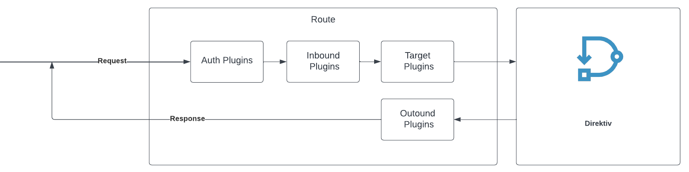

# Gateway

Direktiv offers a gateway (**beta**), providing access to internal resources via custom [routes](routes.md). The gateway primarily serves to modify or enrich incoming requests and implement authentication. 
By adopting this approach, external clients can be decoupled from direct access to the internal Direktiv [API](../api.md) but use custom routes instead. 
With the additional use of plugins the consumption of flows by clients can be made easier and faster. In particular in integration scenarios Direktiv's gateway and it's routes can speed up that process.

Direktiv's gateway contsist of three main components:

- [Routes](routes.md)
- [Consumers](consumers.md)
- [Plugins](plugins/auth/index.md)